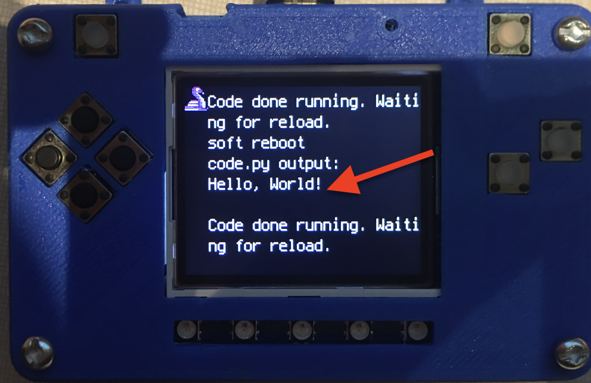

Your IDE
========

One of the great things about CircuitPython hardware is that it just automatically shows up as a USB drive when you attach it to your computer. This means that you can access and save your code using any text editor. This is particularly helpful in schools, where computers are likely to be locked down so students can not load anything. Also students might be using Chromebooks, where only "authorized" Chrome extensions can be loaded.

If you are working on a Chromebook, the easiest way to start coding is to just use the built in `Text app <https://chrome.google.com/webstore/detail/text/mmfbcljfglbokpmkimbfghdkjmjhdgbg?hl=en>`_. As soon as you open or save a file with a :file:`*.py` extension, it will know it is Python code and automatically start syntax highlighting.

.. figure:: ./chrome_text_ide.png
    :width: 480 px
    :align: center
    :alt: Chromebook Text Editor

    Chromebook Text app

If you are using a non-Chromebook computer, your best beat for an IDE is `Mu <https://codewith.mu>`_. You can get it for Windows, Mac, Raspberry Pi and Linux. It works seamlessly with CircuitPython and the serial console will give you much needed debugging information. You can download Mu `here <https://codewith.mu/en/download>`_.

.. figure:: ./circuitpython_mu-front-page.png
   :width: 480 px
   :alt: Mu Editor
   :align: center

   Mu IDE

Since with CircuitPython devices you are just writing Python files to a USB drive, you are more than welcome to use any IDE that you are familiar using.

Hello, World!
-------------

Yes, you know that first program you should always run when starting a new coding adventure, just to ensure everything is running correctly! Once you have access to your IDE and you have CircuitPython loaded, you should make sure everything is working before you move on. To do this we will do the traditional "Hello, World!" program. By default CircuitPython looks for a file called :file:`code.py` in the root directory of the PyBadge to start up. You will place the following code in the :file:`code.py` file:

.. code-block:: python
	:linenos:

	print("Hello, World!")

As soon as you save the file onto the PyBadge, the screen should flash and you should see something like:

   Hello, World! program on PyBadge

Although this code does work just as is, it is always nice to ensure we are following proper coding conventions, including style and comments. Here is a better version of Hello, World! You will notice that I have a call to a :py:func:`main()` function. This is common in Python code but not normally seen in CircuitPython. I am including it because by breaking the code into different functions to match different scenes, eventually will be really helpful.

.. literalinclude:: ./example.py
   :language: py
   :lines: 10-20

.. code-block:: python
	:linenos:

	#!/usr/bin/env python3

	# Created by : Mr. Coxall
	# Created on : January 2020
	# This program prints out Hello, World! onto the PyBadge

	  
	def main():
	    # this function prints out Hello, World! onto the PyBadge
	    print("Hello, World!")

	if __name__ == "__main__":
	    main()
    

Congratulations, we are ready to start.
