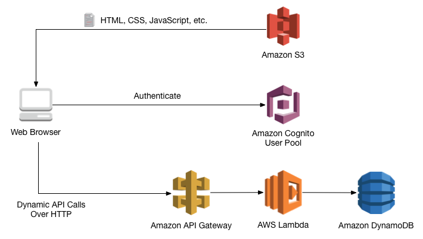

Home
====

In this project we will be making an AWS Serverless Web App. We will be using an AWS Educate Student account, so anyone should have enough permissions to make this app. It is assumed that you already have not only an AWS account but also a GitHub account and know basic HTML, CSS, JavaScript and Python for the back end.

.. toctree::
  :maxdepth: 2
  :hidden:
  :titlesonly:

  self
  step0/index
  step1/index
  step2/index
  step3/index
  step4/index
  step5/index
