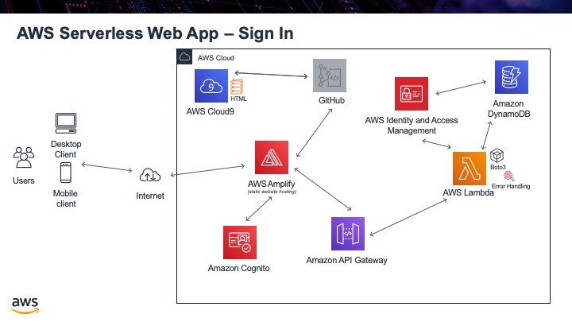

.. _step10:

*******
Sign In
*******

Now that we have a user in the Cognito system, we need a way for the user to actually sign into the app. Cognito does provide a built in UI for this as well, but it does not work nicely with the way we will be building our app. We will actually write our own html page, that uses some provided JavaScript libraries to log in.

What we will do is download the libraries we need and place them in a folder called "js". This is a standard name used to place all your JavaScript files in. Once all the librarys are downloaded, you then need to update the **config.js** file with the information from Cognito. The we will write the HTML to have the login and password entered and a button to login. When you click on the button, a function will be called to check if this is a valid user from Cognito and if it is we will retruned a **token** and the user name. This will prove it is a valid user.

Tasks:

- download the JavaScript libraries, `from here <https://github.com/MotherTeresaHS/AWS-Serverless-Web-Application/tree/master/js/>`_, and place them in a js folder
- update the config.js file with your app information
- write file sign-in.html, that has 2 input boxes and a sign in button
- write the JavaScript function to sign the user in
- if the user is valid, show the user email address, returned from Cognito as well as a JWT token

.. code-block:: shell
	:linenos:

	<!DOCTYPE html>

	<html lang="en">
	  <head>
	    <meta charset="utf-8">

	  	<!-- Javascript SDKs-->
	  	
	  	
	  	 
	  	   
	  	
	  </head>
	  
	  <body>
	    <form>
	      <h1>Please sign in</h1>

	      <input type="text" id="inputUsername"  placeholder="Email address" name="username" required autofocus>
	      <input type="password" id="inputPassword"  placeholder="Password" name="password" required>    
	      <button type="button" onclick="signInButton()">Sign in</button>
	    </form>
	    
	     
	    

	      

	    

	    
	    
<a href="./profile.html">Profile</a>

	    
	     
	    

	      

	        <a href='./index.html'>Home</a>
	      

	    

	    
	    
	  </body>
	</html>

.. raw:: html

  

	<iframe width="560" height="315" src="https://www.youtube.com/embed/b72PvMBcVTw" frameborder="0" allow="accelerometer; autoplay; encrypted-media; gyroscope; picture-in-picture" allowfullscreen>
	</iframe>
  

