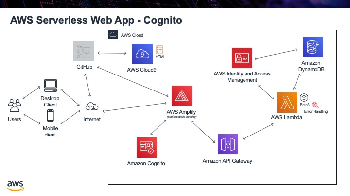

.. _step11:

********
Sign Out
********

The next major task is to have the ability to sign in to our website. This prevents people from accessing things they should not and will also give use the ability to present individualized content for a particular user that has signed in, since we know who is looking at the website.

To do this we are going to use an AWS service called Cognito. This will provide all the user account management, importantly managing the users login and password. You do not want to manage users passwords yourself, this is a really complicated thing to do properly. (see the video below on why you should never save user passwords). To avoid this cognito will manage our user login, the email address, and the passwords. We will use built in JavaScript libraries, provided by Cognito, to check what user has just signed in. 

Tasks:

- create an AWS Cognito user pool
- create an app client
- download the JavaScript libraries, `from here <https://github.com/MotherTeresaHS/AWS-Serverless-Web-Application/tree/master/js/>`_, and place them in a js folder
- update the config.js file with your app information
- use the Cognito built in sign up URL to create a user and click on the provided link to confirm the user
- confirm the user now exists in the Congnito pool
- ensure this user also exists in the DynamoDB table, so that this user has information in your table

.. code-block:: html
	:linenos:

	<!DOCTYPE html>
	<html>
	  <head>
	    <meta charset="UTF-8">
	    <meta name="description" content="This website demos an AWS Serverless Web App">
	    <meta name="keywords" content="AWS Serverless Web App">
	    <meta name="author" content="Mr. Coxall">
	    <meta name="date" content="Jan 2020">
	    <meta name="viewport" content="width=device-width, initial-scale=1.0">
	    
	    <title>Web App</title>
	    
	    
	  </head>
	  <body>
	    

	      <button onclick="getUserProfile('mr.coxall@mths.ca')">Get Profile data</button>
	    

	     
	    

	    

	  </body>
	</html>

.. raw:: html

  

	<iframe width="560" height="315" src="https://www.youtube.com/embed/8ZtInClXe1Q" frameborder="0" allow="accelerometer; autoplay; encrypted-media; gyroscope; picture-in-picture" allowfullscreen>
	</iframe>
  

.. raw:: html

  

	<iframe width="560" height="315" src="https://www.youtube.com/embed/IBfbIfa1YFc" frameborder="0" allow="accelerometer; autoplay; encrypted-media; gyroscope; picture-in-picture" allowfullscreen>
	</iframe>
  

.. seealso:: Most of my Cognito code came from `this <https://github.com/nrao57/AWS-Cognito-Tutorials>`_ tutorial