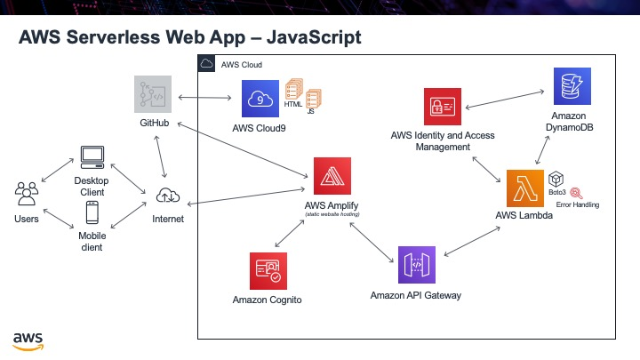

.. _step13:

**********
JavaScript
**********

The basics of our app are now complete. The next thing to tackle is to fix up our HTML. It is good practise to actually remove the JavaScript code from within the HTML documents and place it in a seperate file. This way the code and content are seperate. What we will do to start is remove the **get_user()** function from ``profile.html`` and call it from our HTML. We will then remove the JavaScript code from ``sign-in.html`` and ``sign-out.html`` and create ``*.js`` files for the JavaScript code in each of these files. When done, all JavaScript will be moved out of the HTML files and into their own files.

Tasks:

- create a js directory and a JavaScript file for our code
- move the **
            
             
               
            
            
          </head>
          
          <body>
            <form>
              <h1>Please sign in</h1>

              <input type="text" id="inputUsername"  placeholder="Email address" name="username" required autofocus>
              <input type="password" id="inputPassword"  placeholder="Password" name="password" required>    
              <button type="button" onclick="signInButton();">Sign in</button>
            </form>
            
             
            

              

            

            
            
<a href="./profile.1.html">Profile</a>

            
             
            

              

                <a href='./index.1.html'>Home</a>
              

            

            
          </body>
        </html>

  .. group-tab:: sign-in.js
  
    .. code-block:: javascript
        :linenos:

        // JavaScript File

        function signInButton() {
          // sign-in to AWS Cognito
          
          var data = { 
              UserPoolId : _config.cognito.userPoolId,
            ClientId : _config.cognito.clientId
          };
          var userPool = new AmazonCognitoIdentity.CognitoUserPool(data);
          var cognitoUser = userPool.getCurrentUser();

            var authenticationData = {
            Username : document.getElementById("inputUsername").value,
            Password : document.getElementById("inputPassword").value,
          };

          var authenticationDetails = new AmazonCognitoIdentity.AuthenticationDetails(authenticationData);

          var poolData = {
            UserPoolId : _config.cognito.userPoolId, // Your user pool id here
            ClientId : _config.cognito.clientId, // Your client id here
          };

          var userPool = new AmazonCognitoIdentity.CognitoUserPool(poolData);

          var userData = {
            Username : document.getElementById("inputUsername").value,
            Pool : userPool,
          };

          var cognitoUser = new AmazonCognitoIdentity.CognitoUser(userData);

          cognitoUser.authenticateUser(authenticationDetails, {
            onSuccess: function (result) {
              var accessToken = result.getAccessToken().getJwtToken();
              console.log(result);  
              
              //get user info, to show that you are logged in
                    cognitoUser.getUserAttributes(function(err, result) {
                        if (err) {
                            console.log(err);
                            return;
                        }
                        console.log(result);
                        document.getElementById("logged-in").innerHTML = "You are logged in as: " + result[2].getValue();
                        
                        // now auto redirect to profile page
                        window.location.replace("./profile.1.html");
                    });
              
            },
            onFailure: function(err) {
              alert(err.message || JSON.stringify(err));
            },
          });
        }

.. raw:: html

  

    <iframe width="560" height="315" src="https://www.youtube.com/embed/IBfbIfa1YFc" frameborder="0" allow="accelerometer; autoplay; encrypted-media; gyroscope; picture-in-picture" allowfullscreen>
    </iframe>
  
