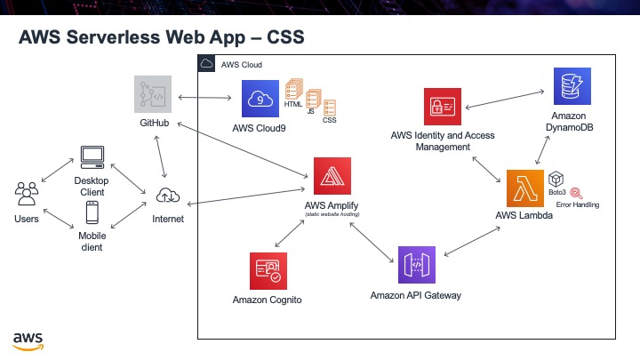

.. _step14:

***
CSS
***

To make our website look more professional and also be help in maintaining its style, we will be using `Google's MDL <https://getmdl.io/>`_. This will acc CSS to our website.

Tasks:

- fix up som HTML code
- add Google's MDL CSS from its CDN, so we do not have to host it

.. code-block:: html
	:linenos:

	<!DOCTYPE html>
	<html>
	  <head>
	    <meta charset="UTF-8">
	    <meta name="description" content="This website demos an AWS Serverless Web App">
	    <meta name="keywords" content="AWS Serverless Web App">
	    <meta name="author" content="Mr. Coxall">
	    <meta name="date" content="Jan 2020">
	    <meta name="viewport" content="width=device-width, initial-scale=1.0">
	    
	    <title>Web App</title>
	    
	    
	  </head>
	  <body>
	    

	      <button onclick="getUserProfile('mr.coxall@mths.ca')">Get Profile data</button>
	    

	     
	    

	    

	  </body>
	</html>

.. raw:: html

  

	<iframe width="560" height="315" src="https://www.youtube.com/embed/IBfbIfa1YFc" frameborder="0" allow="accelerometer; autoplay; encrypted-media; gyroscope; picture-in-picture" allowfullscreen>
	</iframe>
  

.. seealso:: Google's `Material Design Lite <https://getmdl.io/index.html>`_ website