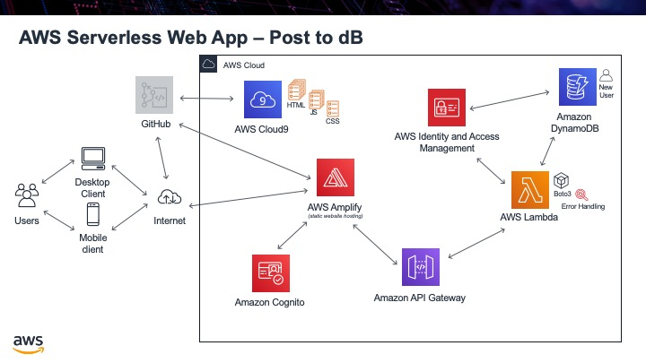

.. _step15:

****************
Post to dataBase
****************

The next step we need to be able to do is create a new row in the database. To do this we run the command **put_Item**. We will once again have to make a Lambda function to run this code. We will not actually create an API Gateway to access this code, instead in the next step we will get Cognito to automatically **trigger** this Lambda function when a new user is created. 

The reason we need this is that Cognito is taking care of the user sign-in for us. But when a new user registeres Cognito knows about the new user, but our DynamoDB does not. What we need to happen is for Cognito to add a new row with the users email address into our database. Since Cognito is sending the information to Lambda, once again as a JSON file, we will need to know what this JSON file will look like, so we can parse it appropriately. From this https://stackoverflow.com/questions/49580078/send-username-to-aws-lambda-function-triggered-by-aws-cognito-user-confirm website we know that the JSON file Cognito will send is like this:

.. code-block:: json
  :linenos:
  :caption: Lambda function parameters from Cognito for post-confirmation trigger

    {
      "version": "1",
      "region": "eu-central-1",
      "userPoolId": "eu-central-1_45YtlkflA",
      "userName": "user4",
      "callerContext": {
          "awsSdkVersion": "aws-sdk-java-console",
          "clientId": "4736lckau64in48dku3rta0eqa"
      },
      "triggerSource": "PostConfirmation_ConfirmSignUp",
      "request": {
          "userAttributes": {
              "sub": "a2c21839-f9fc-49e3-be9a-16f5823d6705",
              "cognito:user_status": "CONFIRMED",
              "email_verified": "true",
              "email": "asdfsdfsgdfg@carbtc.net"
          }
      },
      "response": {}
    } 

Therefore, since we are looking for the email address of the user the very bearried piece of information we are looking for is: event['request']['userAttributes']['email']. We will also only be entering in the email address column inot the database. THis is ok, since it is the primary key, and the rest of the information the user can add in a **Profile Edit** page. It also turns out that Cognito is very particular about what it gets back as a response. Before we were sending back JSON files for the web, but this is not going to the web. Cognito is actually looking for the **event** object to be retruned to it. This signals that everything went OK. Anything else is considered an error.

Tasks:

- create Lambda function called **add_user**
- write code to create the row in our database
- write test case to see new row show up in database, ensuring we are using the sample JSON file Conginto will send us
- test it out and seeing row show up

.. code-block:: python
  :linenos:
  :caption: Lambda function to create row in DynamoDB

    #!/usr/bin/env python3

    # Created by: Mr. Coxall
    # Created on: Dec 2019
    # This function adds a row from our chocolate_user DynmamoDB

    import json
    import boto3

    def lambda_handler(event, context):
        # function returns a row from our chocolate_user DynmamoDB
        
        dynamodb = boto3.resource('dynamodb')
        table = dynamodb.Table('chocolate_user')
        
        try:
            response = table.put_item(
                Item = {
                    'email': event['request']['userAttributes']['email']
                }
            )
            
            try:
                result = response['ResponseMetadata']
            except:
                result = {}
            
            print(result)
            return_var = json.dumps(result)
        
            print(result)
            
            # Cognito is expecting the "event" object to be returned for success
            return event
            
        except:
           return "error"

.. raw:: html

  

  <iframe width="560" height="315" src="https://www.youtube.com/embed/IBfbIfa1YFcxxx" frameborder="0" allow="accelerometer; autoplay; encrypted-media; gyroscope; picture-in-picture" allowfullscreen>
  </iframe>
  

.. seealso:: StackOVerflow `Send username to aws Lambda function triggered by aws Cognito user confirm <https://stackoverflow.com/questions/49580078/send-username-to-aws-lambda-function-triggered-by-aws-cognito-user-confirm>`_ 