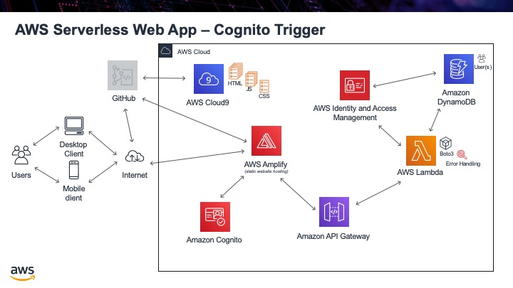

.. _step16:

***************
Cognito Trigger
***************

A next nice step would be if we could upload an image to use as the profile image of the user. The problem is that an image cannot be saved into our DynamoDB table. It can only hold text or numbers. What we can do instead is create an S3 bucket and save our images into it. Then we just save the **key** in our table, that points to our particular image.

Before we do anything else, if we want to access the image later with a Lambda function to return the image to the web, the Lambda function need permission to access S3. Go back to IAm and add the permission **AmazonS3FullAccess** to our "Role". Once this is done, go to S3 and create a bucket. By defauly every bucket on S3 for all users must have a unique name, so you will not be able to use the name I gave it, but just remember your name. Kepp all the defaults as is.

Next we have to enable **CORS** again, so that different domains can be used in our web application. Here is the CORS JSON file permissions:

.. code-block:: json
  :linenos:
  :caption: CORS permissions for S3

	<?xml version="1.0" encoding="UTF-8"?>
	<CORSConfiguration xmlns="http://s3.amazonaws.com/doc/2006-03-01/">
	<CORSRule>
	    <AllowedOrigin>*</AllowedOrigin>
	    <AllowedMethod>PUT</AllowedMethod>
	    <AllowedMethod>POST</AllowedMethod>
	    <AllowedMethod>DELETE</AllowedMethod>
	    <AllowedHeader>*</AllowedHeader>
	</CORSRule>
	</CORSConfiguration>

Upload and image to the S3 bucket. For consistancy we will use the email address of the user as the file name. For example: mr.coxall@mths.ca.jpg will be the file name. I know using the "@" is highly unusual, but it will work.

Tasks:

- add AmazonS3FullAccess to our IAM Roll
- create S3 bucket
- upload an image to the bucket, using the email address as the file name

.. raw:: html

  

  <iframe width="560" height="315" src="https://www.youtube.com/embed/IBfbIfa1YFcxxx" frameborder="0" allow="accelerometer; autoplay; encrypted-media; gyroscope; picture-in-picture" allowfullscreen>
  </iframe>
  

