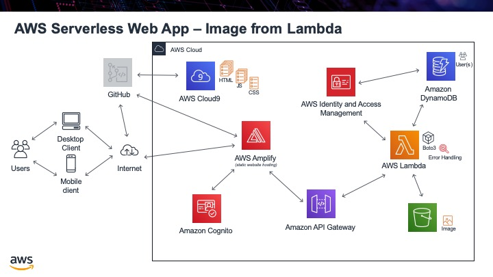

.. _step18:

*********************
Get Image from Lambda
*********************

Now that we have our image in S3, we need to be able to get it out using Lambda. To do that create a new Lambda function called **get_profile_image**. One problem we have is that we have to pass the image eventually to API Gateway as a JSON file. We can not pass it as a ".jpg" file. To do this we will access the image, convert it to **base64** and then pass it out of our function as a JSON file. Our JavaScript function on our web front end will then un-encode it and present it back as an image. 

Here is the Lambda function code:

.. code-block:: pyhton
  :linenos:
  :caption: Get S3 image and return it as JSON

  import boto3
  import base64
  from boto3 import client

  def lambda_handler(event, context):
      # got this function from: https://stackoverflow.com/questions/36240356/lambda-get-image-from-s3
      profile_image_key = event['email_address']
      user_download_img = profile_image_key + '.jpg'

      s3 = boto3.resource('s3')
      bucket = s3.Bucket(u'coxall-profile-photo') 
      obj = bucket.Object(key = user_download_img)      #pass your image Name to key
      response = obj.get()     #get Response
      img = response[u'Body'].read()        # Read the respone, you can also print it.
      #print(type(img))                      # Just getting type.
      myObj = [base64.b64encode(img)]          # Encoded the image to base64
      #print(type(myObj))            # Printing the values
      #print(myObj[0])               # get the base64 format of the image
      #print('type(myObj[0]) ================>',type(myObj[0]))
      return_json = str(myObj[0])           # Assing to return_json variable to return.  
      #print('return_json ========================>',return_json)
      return_json = return_json.replace("b'","")          # replace this 'b'' is must to get absoulate image.
      encoded_image = return_json.replace("'","")   

      return {
          'status': 'True',
          'statusCode': 200,
          'message': 'Downloaded profile image',
          'encoded_image':encoded_image          # returning base64 of your image which in s3 bucket.
      }
  # to prove that this is returning the image goto this website 
  # https://codebeautify.org/base64-to-image-converter
  # place the "encoded_image" into "Enter Base64 String"
  # when doing so, ensure you do not include the quotes
  # you should get back your image 
  # :)

Use this URL (https://codebeautify.org/base64-to-image-converter) to prove that what you are getting back from the Lambda function really is the image.

Tasks:

- create Lambda function, get_profile_image
- create test case to get back example JSON file
- prove JSON file does contain the image

.. raw:: html

  

  <iframe width="560" height="315" src="https://www.youtube.com/embed/IBfbIfa1YFcxxx" frameborder="0" allow="accelerometer; autoplay; encrypted-media; gyroscope; picture-in-picture" allowfullscreen>
  </iframe>
  

